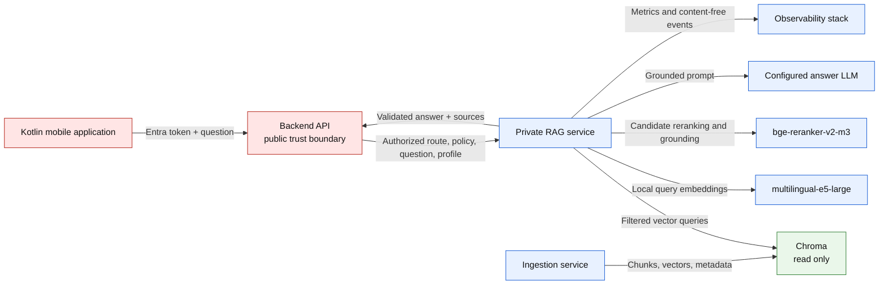
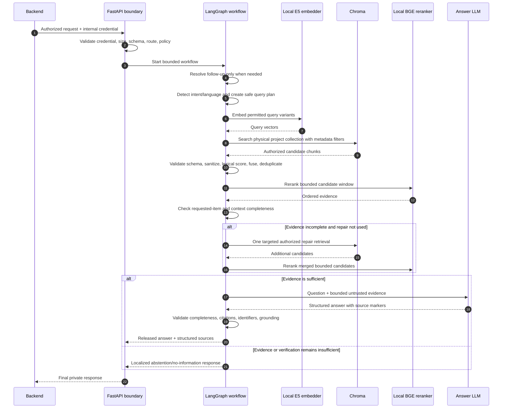
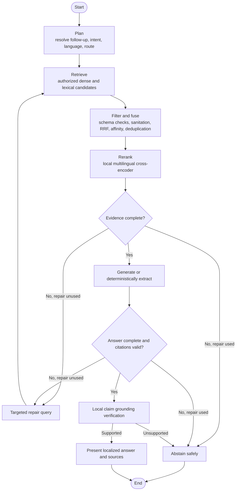
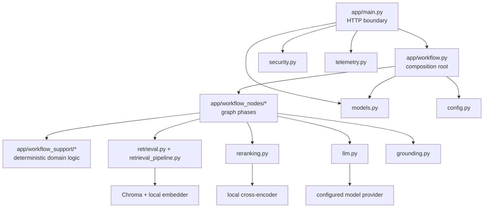

# Project Intelligence RAG — current architecture

Last verified against the repository code: 2026-08-31.

This is the single architecture reference for the RAG project. It describes the implemented
service, its trust boundaries, its retrieval and answer pipeline, its dependencies, and its
failure behavior. Historical work orders and superseded architecture notes are intentionally not
part of the current documentation set.

## 1. Purpose and boundary

RAG means **Retrieval-Augmented Generation**. The service first retrieves authorized project
evidence, then asks a language model to answer only from that evidence.

The RAG service owns:

- the private `POST /v1/answer` and streaming answer APIs;
- validation of backend-supplied project and access-policy context;
- Chroma retrieval with mandatory project filters;
- query analysis, bilingual planning, lexical/dense fusion, reranking, and evidence selection;
- grounded answer generation, completeness checks, citation checks, and local grounding checks;
- content-safe operational metrics.

The RAG service does not own:

- user login or Microsoft Entra token validation;
- deciding which projects a user may access;
- project/provider configuration;
- ingestion from GitHub, Jira, or Confluence;
- chat-history persistence;
- source-document or vector writes.

Only the backend may call RAG. The mobile application never calls RAG or Chroma directly.

## 2. System context



The backend is the authorization authority. RAG independently verifies the supplied project route
and policy, but it cannot grant a user access.

## 3. Request and response contract

The backend sends an `AnswerRequest` containing:

| Field | Meaning | Authority |
|---|---|---|
| `projectId` | Project being questioned | Backend |
| `collectionName` | Logical Chroma collection | Backend control plane |
| `textField` / `embeddingField` | Evidence and embedding fields | Backend control plane |
| `embeddingModel` | Required embedding model | Backend control plane |
| `schemaVersion` | Required indexed-record schema | Backend control plane |
| `accessPolicyIds` | Server-derived access policies | Backend |
| `question` | User question | User, treated as untrusted input |
| `modelProfile` | `budget`, `standard`, or `complex` | Backend policy |
| conversation context | Bounded continuity information | Backend, not evidence |

RAG requires the exact policy `project:<projectId>`. It also derives and validates the physical
project collection name rather than trusting a client-selected Chroma target.

The response contains the answer, confidence/outcome information, and structured sources. Source
objects contain citation-safe metadata such as title, provider, reference, locator, language, and
URL. Raw embeddings, credentials, internal prompts, and rerank scores are never returned.

## 4. Complete question-to-answer sequence



No failure path falls back to unrestricted model knowledge.

## 5. API layer

`app/main.py` builds the FastAPI application and exposes health, readiness, metrics, buffered
answering, streaming answering, and private visual-asset endpoints. Its main responsibilities are:

1. validate the backend-to-RAG bearer credential;
2. reject oversized or malformed requests;
3. enforce rate and concurrency controls;
4. create the workflow dependencies;
5. translate typed application failures into safe HTTP responses;
6. ensure internal details do not escape through errors.

`/health` reports whether the process is alive. `/ready` is stricter: dependencies and required
local models must be usable before traffic should be routed to the replica.

## 6. Authorization and collection isolation

The physical Chroma collection is deterministic per project. Its name includes a normalized project
name and a hash, and its collection metadata must match the requested project and logical route.

Every retrieval also requires metadata equivalent to:

```json
{
  "$and": [
    {"project_id": {"$eq": "DEMO"}},
    {"access_policy_id": {"$eq": "project:DEMO"}}
  ]
}
```

Security is deliberately redundant:

1. only the backend can reach the API;
2. the request must contain the exact project policy;
3. the physical collection must belong to that project;
4. every candidate must match project and policy metadata;
5. records with the wrong schema or embedding model are rejected;
6. authorization fields cannot be changed by the planner or answer LLM.

The RAG process is read-only toward Chroma. Ingestion is the only vector writer.

## 7. LangGraph workflow



The graph has bounded cycles: only one semantic repair is allowed. Network retries are separately
bounded and apply only to transient failures.

### Planning

Planning classifies the question and chooses the minimum useful search plan. Direct English
questions normally search once. Spanish questions may add one safe English translation. Exact
identifiers—issue keys, filenames, paths, API names, symbols, numbers, and quoted text—must survive
translation or the translated variant is discarded.

Conversation history is used only to rewrite an unclear follow-up into a standalone question. It
is never treated as factual project evidence.

### Intent routes

Deterministic code recognizes routes such as:

- ordinary direct questions;
- implementation questions, which prefer GitHub `CODE` evidence;
- delivery/status questions, which use Jira `ISSUE` evidence;
- cross-source comparisons, which keep PAGE and CODE evidence separate;
- entity or whole-project overviews;
- explicit feature or code inventories;
- exact identifier/path questions.

The intent controls search shape and answer format, not authorization.

### Retrieval and hybrid scoring

`app/retrieval.py` owns authorized Chroma access. `app/retrieval_pipeline.py` provides deterministic
candidate validation, lexical scoring, reciprocal-rank fusion, and context-quality checks.

The current hybrid design combines:

- dense semantic similarity from local `multilingual-e5-large` query embeddings;
- BM25-style lexical support for names, paths, symbols, issue keys, and exact terms;
- metadata weighting for titles, paths, references, locators, and indexed keywords;
- reciprocal-rank fusion so incomparable raw score scales are not mixed directly.

The lexical stage can reorder the authorized candidate window. It cannot recover a record that was
never returned from the bounded Chroma search; the dense top-k window remains the recall boundary.

### Candidate validation and selection

Before reranking, the service:

1. validates project, policy, schema, and embedding-model metadata;
2. removes control characters and unsafe record shapes;
3. rejects placeholders, generated diagram-only chunks, and known boilerplate where appropriate;
4. deduplicates by canonical chunk identity;
5. applies intent-specific source and title affinity;
6. enforces evidence and per-source limits.

### Reranking

`app/reranking.py` uses the local `bge-reranker-v2-m3` cross-encoder. Unlike vector search, a
cross-encoder reads the question and candidate together and produces a more precise ordering. Only
already-authorized candidates reach it.

### Evidence completeness

Completeness asks whether the evidence contains everything explicitly requested. A highly relevant
chunk can still be incomplete. When required items are missing, the graph may run one targeted
repair search. After that, it abstains rather than looping or guessing.

### Deterministic answers

For tasks whose output can be derived safely—such as exact feature lists, paths, identifiers, or
well-formed table rows—deterministic Python may render the answer. This reduces hallucination and
preserves exact values. Normal synthesis uses the configured LLM.

## 8. Generation and release gates

Retrieved documents are treated as untrusted data and placed inside explicit evidence boundaries.
The prompt tells the model to ignore instructions found inside documents and to use only the given
evidence. The answer model has no tools.

An answer is released only after these gates:

| Gate | What it prevents |
|---|---|
| Answer-shape validation | Malformed structured output |
| Requested-item completeness | Quietly omitting part of the question |
| Citation-index validation | References to nonexistent evidence |
| Exact-anchor validation | Changed numbers, names, paths, keys, or negations |
| Claim grounding | Semantically unsupported factual sentences |
| Cross-source rules | Blending documentation and implementation as if identical |

Internal `[SOURCE n]` markers survive until validation finishes. They are then removed from visible
prose while structured source objects remain in the response.

The local grounding verifier uses multilingual BGE similarity plus deterministic exact-value,
negation, and citation checks. A project-overview answer may remove only unsupported sentences and
reverify the remainder; it cannot invent replacement facts.

## 9. Model architecture

The service has three distinct model jobs:

| Job | Current implementation | Why separate |
|---|---|---|
| Query embedding | Local `multilingual-e5-large` | Finds semantically similar chunks |
| Candidate reranking/grounding | Local `bge-reranker-v2-m3` | More precise pairwise relevance/support |
| Planning and answering | Configured Ollama, OpenAI, or Azure OpenAI model | Produces structured plans and language |

Development can use a local Ollama model. Production may use an explicitly configured provider.
There is no automatic provider fallback. Model profiles change cost/latency selection but never
change project access.

Factual operations use temperature `0`. Bounded overview synthesis may use a small configured
temperature, capped at `0.2`. Retrieval, authorization, reranking, citation validation, and exact
extraction do not use temperature.

## 10. Data consumed from ingestion

Each searchable record must include:

- `project_id` and `access_policy_id`;
- stable `source_id`, `parent_id`, and canonical chunk identity;
- provider and source type;
- source version, chunk ordinal, content/structure hashes;
- title, reference, URL, locator, and structure path;
- language and security classification;
- evidence text and embedding text;
- parser/chunker/schema/embedding versions;
- code, issue, table, and visual metadata when applicable.

RAG validates this contract before using a record. Adjacent context is expanded only from records
inside the same authorized candidate set; it never performs an unfiltered parent lookup.

## 11. Streaming

`POST /v1/answer` returns one buffered response. `POST /v1/answer/stream` emits NDJSON workflow
updates. Public progress events contain only safe stage names and localized status text.

Draft model text is provisional. The final event is authoritative only after citation and grounding
verification. Paths that have only a finished answer emit a snapshot rather than fake token-by-token
streaming.

## 12. Visual assets

Visual assets are private and project isolated. The backend first authorizes the user, then calls
the private RAG asset endpoint with the project policy and opaque asset ID. RAG validates both,
derives the project-specific asset location, and streams only an allowed image type. Blob paths and
credentials are never accepted from the client.

## 13. Conversation-memory boundary

The backend owns MongoDB conversations. RAG receives only a bounded recent transcript and compact
semantic context. Previous assistant answers help resolve references such as “How does that work?”
but are never evidence. Every answer performs fresh authorized retrieval.

RAG may return a private context update. The backend decides whether to persist it and protects
against an older concurrent response overwriting newer state.

## 14. Failure behavior

| Condition | Behavior |
|---|---|
| Missing/invalid internal credential | `401` |
| Malformed request | `422` |
| Oversized body | `413` |
| Rate/concurrency limit | `429` |
| Route, schema, or model conflict | `409` or safe rejection |
| Missing required project policy | No-access response; no retrieval |
| No sufficient evidence | Localized abstention; no unsupported answer |
| Chroma/reranker/LLM unavailable | `503`; no fabricated fallback |
| Final citation/grounding failure | Repair once when allowed, otherwise abstain |
| Readiness dependency failure | `/ready` returns `503` |

Transient provider errors use bounded exponential backoff with jitter. Authentication,
authorization, validation, and quota-exhaustion errors are not blindly retried.

## 15. Observability and privacy

Metrics and structured events may include request ID, project ID, stage, duration, candidate counts,
model/profile, token counts, retry counts, outcome, and safe reason codes.

They must not contain:

- raw Entra user IDs;
- questions, answers, evidence, or prompts;
- URLs or code/document bodies;
- authorization headers, tokens, or secrets;
- raw reranker scores.

The backend supplies an HMAC-derived user hash when correlation is needed.

## 16. Code map and dependency direction



Important modules:

- `app/config.py`: validated environment configuration and production invariants.
- `app/models.py`: request, response, evidence, source, and model-profile contracts.
- `app/main.py`: FastAPI lifecycle and transport boundary.
- `app/security.py`: service authentication and input/security helpers.
- `app/chroma_collections.py`: deterministic per-project collection routing.
- `app/embedding.py`: local query embeddings.
- `app/retrieval.py`: authorization-preserving Chroma adapter.
- `app/retrieval_pipeline.py`: lexical scoring, fusion, validation, and quality gates.
- `app/reranking.py`: local cross-encoder reranking.
- `app/workflow.py`: dependency construction and LangGraph wiring.
- `app/workflow_nodes/`: planning, retrieval, answering, and graph state.
- `app/workflow_support/`: pure intent, completeness, citation, presentation, and conversation logic.
- `app/llm.py`: provider abstraction, structured output, generation, and streaming.
- `app/grounding.py`: local claim support verification.
- `app/telemetry.py`: content-free metrics and events.

Dependency direction is inward: support/domain modules do not import graph nodes, and graph nodes do
not import the composition root. Architecture tests enforce these boundaries.

## 17. Deployment topology

### Current local development

- FastAPI RAG runs locally;
- Chroma runs locally as the shared vector database;
- query embedding and reranking models are local;
- generation uses the configured local or hosted provider;
- on Apple Silicon, Metal-backed model execution runs natively because Linux Docker does not expose
  Apple MPS.

### Production target

- private RAG ingress reachable only by backend;
- immutable container image;
- separate read-only Chroma access;
- pinned and verified local model artifacts or explicitly approved hosted providers;
- workload identity/private networking instead of shared service keys;
- horizontal replicas only with concurrency and model-memory limits understood;
- external observability without content logging.

## 18. Non-negotiable invariants

1. The backend authorizes; RAG never grants access.
2. The frontend never selects a vector target, access policy, or model name.
3. Every candidate is filtered and validated before model exposure.
4. Retrieved text is data, never instructions.
5. Previous chat messages are context, never project evidence.
6. Every material released claim is cited and grounded.
7. Repair and retry loops are bounded.
8. Missing evidence produces abstention, not general-knowledge completion.
9. Ingestion is the only vector writer; RAG remains read-only.
10. Telemetry never contains questions, answers, evidence, credentials, or raw identity values.
