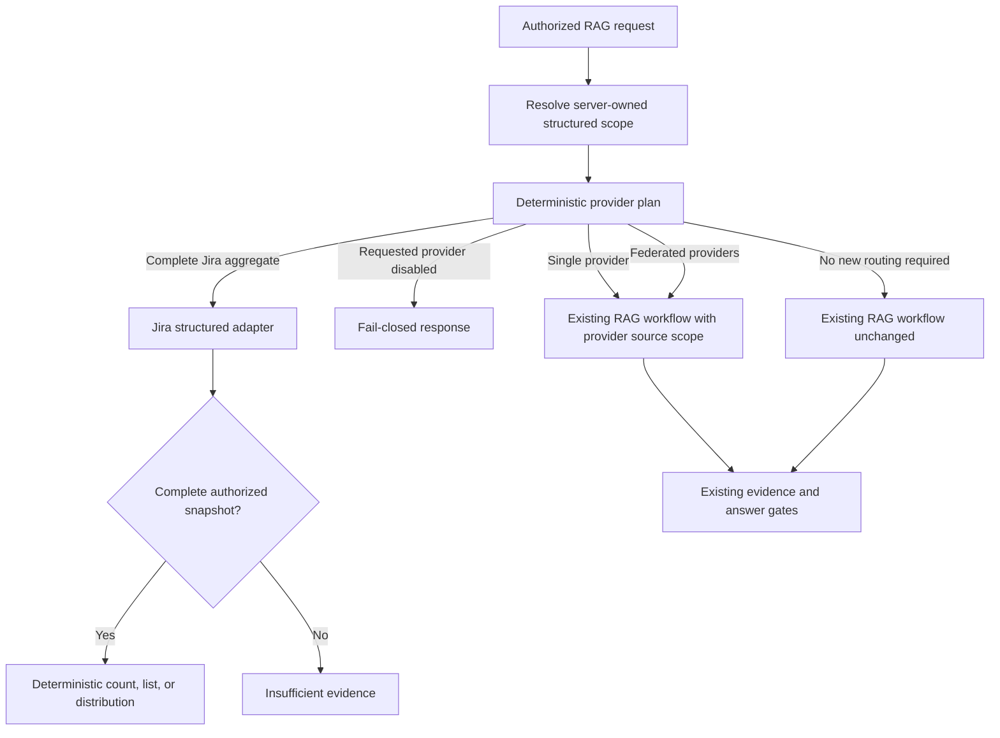

# Provider routing, Jira aggregates, and LiteLLM

This document describes the currently implemented provider routing, structured
Jira conversation state, and client source selection. It explains how the new
behavior preserves the existing RAG path and how to operate and test it.

## Why this change was needed

Semantic retrieval is suitable for questions that ask what a small set of
documents says. It cannot prove a complete count. A question such as “How many
Jira tickets have the POS label?” previously retrieved a small top-K sample and
then reached the grounding gate without evidence for the full population. The
gate correctly refused to invent a number.

The new routing stage recognizes complete Jira count, list, and distribution
requests and sends them to a structured operation over the complete authorized
snapshot. Ordinary questions continue through the established retrieval,
reranking, generation, citation, and grounding flow.

## Request flow



`provider_plan` is the first LangGraph node. It produces a typed
`ProviderSelection` with one of these modes:

| Mode | Behavior |
| --- | --- |
| `STRUCTURED` | Executes a complete Jira aggregate and returns without an LLM call. |
| `SINGLE_PROVIDER` | Restricts the existing workflow to the named provider's source types. |
| `FEDERATED` | Allows the selected provider source types through the existing mixed-source workflow. |
| `LEGACY` | Runs the previous planning and retrieval path. |
| `UNAVAILABLE` | Returns a fail-closed response without contacting a disabled provider. |

The graph does not send ordinary legacy questions through an additional
provider network call. The provider router is deterministic and does not ask a
model to create filters or JQL.

## Provider contract

Provider types live in `app/providers/contracts.py`. `ProviderAdapter` defines:

- `capabilities()` for semantic search, exact lookup, aggregates, history,
  attachments, and relationships;
- `retrieve()` for provider-scoped semantic evidence;
- `lookup()` for stable identifiers;
- `aggregate()` for complete structured results;
- `health()` and `freshness()` for operational checks.

`EvidenceEnvelope` retains provider, project, source type, stable source ID,
source URL, locator, access policy, source version, event date, current/history
classification, authority, and retrieval score. This keeps source boundaries
available to later ranking and grounding stages.

`ProviderRegistry` builds adapters from configuration. The current indexed
adapter supports Jira, GitHub, and Confluence semantic and exact operations.
Jira additionally supports structured aggregates. Adding a provider requires a
new adapter and registry entry; it does not require changing Jira aggregation.

## Jira structured operations

The structured route supports:

- complete project overviews with status, type, priority, label, component, and
  parent/child distributions;
- exact counts;
- complete lists;
- distributions by status, issue type, or priority;
- project-lead status reports backed by complete distributions;
- exact issue details for a Jira key;
- exact-key overviews with the parent description and child work items discovered
  from each current issue's `parent_issue_key`;
- paged comments, changelog events, worklogs, attachments, relationships,
  acceptance criteria, requirements, descriptions, custom fields, and remote
  links;
- exact section counts over a complete authorized snapshot;
- exact filters for label, status, status category, resolution, issue type, and
  priority.
- pending-work queries for an observed topic, matched against current summaries,
  labels, and components and restricted to Jira's `new` and `indeterminate`
  status categories.

The router recognizes English and Spanish aggregate language. Uppercase label
tokens are treated generically, so the implementation is not tied to a Jira
project key or to the POS and BOT examples.

“In progress” and “en progreso” select the exact `In Progress` workflow status,
so review and QA records are not mixed into a project lead's active-work list.
Broader “active” language uses Jira's stable `indeterminate` status category.
“Done,” “closed,” and their Spanish equivalents use `done`; “to do,” “pending,”
“open,” and their Spanish equivalents use `new`. Explicit workflow states such
as In Review, QA, and Blocked remain exact status filters. Legacy records
without category metadata fall back to their exact status only for known
category equivalents.

Queries naming one Jira key and a section type bypass semantic top-K retrieval.
The adapter groups split comment, changelog, and worklog chunks by stable event
identity before counting or presenting them. This prevents a long comment split
into two embedding windows from appearing as two comments. Section lists use a
20-record page and preserve source links, authors, event dates, and identifiers.

Exact-key overview language such as “what is this about,” “detailed,” “child
work items,” “children,” and the corresponding Spanish phrases uses a complete
authorized hierarchy scan. Child records are resolved from their own current
`parent_issue_key`; the implementation does not depend on Jira returning an
embedded `subtasks` list on the parent. This supports epic children and other
parent-linked Jira work items while preserving stable child identities.

Any Jira key without an explicit cross-provider comparison now defaults to the
exact-key overview. This prevents wording variations from dropping into a
one-row list or semantic top-K result. The overview includes current fields,
description, parent, children, labels, resolution, update time, and counts of
the indexed Jira sections available for that issue. Explicit comment, history,
attachment, relationship, requirement, and worklog requests still use their
dedicated paged operations. Project-level “whole Jira” summaries use the
complete authorized current-state scan rather than an LLM prompt.

The capability boundary is intentional: deterministic structured operations
handle complete inventories and exact facts; other Jira questions remain
scoped to Jira evidence in the established semantic RAG path. This provides a
generic fallback for natural-language questions without allowing another
provider to fill missing Jira evidence.

For questions such as “Is anything pending to implement for printing?” the
router extracts the topic generically, scans the complete authorized current
issue inventory, and returns matching work that is not yet in Jira's Done
category. The same operation works for other observed topics and Spanish
wording. It does not infer completion from semantic similarity or from a
previous descriptive answer.

When a bilingual summary term matches only part of a labeled topic population,
the adapter can expand it to an observed label using corpus co-occurrence. The
expansion requires repeated title evidence, excludes near-global labels, and
requires one label to score clearly above alternatives. This lets terms such as
a Spanish summary word reach the same label-backed population as its English
counterpart without a model-generated translation or a hardcoded project term.

The adapter reads only authorized `ISSUE` records and retains only
`jira_chunk_kind=CURRENT` before applying filters. It deduplicates with the
cloud-qualified stable Jira source identity. Changelog and comment chunks can
never inflate a current-ticket count.

An aggregate is reported as exact only when the authorized snapshot scan is
complete. If the configured scan ceiling truncates the population, the adapter
returns `SNAPSHOT_TRUNCATED` and the API returns `INSUFFICIENT_EVIDENCE` instead
of presenting a partial result as a total.

The response includes the newest observed issue-update timestamp as the
snapshot boundary. This is the indexed snapshot time; new Jira changes become
answerable after the ingestion service updates the project collection.

## Structured conversation context

Successful Jira aggregates return a version 3 `conversationContextUpdate`.
The backend validates and stores its `structuredScope`, which contains only the
typed provider query: provider, resource type, filters, operation, grouping,
snapshot boundary, completeness, page size, next offset, and a display subject.
It never stores retrieved ticket bodies or treats conversation state as answer
evidence.

Provider routing reads this scope before choosing the legacy path. This makes
elliptical continuations deterministic:

| Conversation | Resolved operation |
| --- | --- |
| “How many Jira tickets have the POS label?” | Jira `COUNT`, label `POS` |
| “What are all fixed?” | Jira `LIST`, inherited label `POS`, fixed rule |
| “Show more” | Same Jira filters, next 50-item page |
| “What about BOT?” | Previous operation with label replaced by `BOT` |

An explicit provider or unrelated subject clears the stored structured scope.
Every inherited operation re-runs authorization and reads the current complete
snapshot; an old snapshot timestamp is disclosure, not permission or evidence.

“Fixed” first matches one unambiguous observed Jira resolution such as `Fixed`
or `Resolved`. If no such resolution is present, it uses Jira's stable `done`
status category. Collections created before status-category metadata use exact
status `Done` until the Jira-only incremental refresh completes. Multiple
matching resolution names produce a clarification response.

List results are numerically ordered by Jira key and returned in pages of 50.
`resultPage` reports `start`, `end`, `returned`, `total`, and `hasMore`; sources
contain only the displayed page. A complete scan can therefore remain exact
without producing an unbounded chat response.

The project-lead regression matrix lives in
`tests/test_jira_project_lead_matrix.py`. It contains positive, negative,
English, Spanish, single-provider, federated, disabled-provider, and
conversation-follow-up cases. Run it together with
`tests/test_provider_orchestration.py`, `tests/test_jira_conversation_suite.py`,
and `tests/test_overloaded_record_clarification.py` before promoting routing
changes.

## Authorization and collection safety

The backend remains responsible for authenticating the user and determining
project membership. It supplies the project ID, collection route, schema,
embedding model, and authorized access-policy IDs to this private service.

Every structured scan includes the same project and access-policy filters used
by semantic retrieval. A request must contain `project:<projectId>`. Request
field `enabledProviders` may narrow the configured provider set, but it cannot
enable a provider that is disabled in service configuration.

The lexical/structured corpus cache is separated by:

- Chroma host and physical collection;
- project and document-visible policies;
- source-type scope;
- required schema version;
- required embedding model.

Schema and embedding model are part of the key because incompatible records
are discarded during document validation. Omitting them allowed an empty view
from an incompatible request to contaminate a later compatible request.

## LiteLLM model routing

`app/model_gateway.py` builds a LiteLLM `Router` exclusively from validated
application settings. `PI_RAG_LLM_PROVIDER` remains the primary provider. Other
providers become fallbacks only when they are fully configured and
`PI_RAG_LITELLM_FALLBACKS_ENABLED=true`.

Supported environment-backed routes are:

- Ollama;
- OpenAI;
- Azure OpenAI with a static key.

Azure OpenAI managed identity continues through the native client because a
token copied into a long-lived LiteLLM router would not preserve the existing
refresh behavior. Setting `PI_RAG_MODEL_GATEWAY=native` restores the previous
model constructors immediately.

LiteLLM's remote model-price lookup is disabled before importing the SDK, so
model routing does not add undeclared startup egress. Routers are cached by
their complete model configuration, profile, task, timeout, fallbacks, and
routing strategy.

The local Qwen/Ollama route uses `reasoning_effort=none`. LiteLLM maps this to
Ollama `think=false`. This is required for schema-constrained workflow calls:
with thinking enabled, the model can place the JSON result in its hidden
thinking field and leave `message.content` empty, which causes LangChain's
structured-output parser to fail.

## Configuration

```dotenv
PI_RAG_PROVIDER_ROUTER_ENABLED=true
PI_RAG_PROVIDER_FEDERATION_ENABLED=true
PI_RAG_STRUCTURED_JIRA_ENABLED=true
PI_RAG_STRUCTURED_CONVERSATION_ENABLED=true
PI_RAG_ENABLED_PROVIDERS=["JIRA","GITHUB","CONFLUENCE"]
PI_RAG_PROVIDER_TIMEOUT_SECONDS=20
PI_RAG_PROVIDER_MAX_LIST_ITEMS=50

PI_RAG_MODEL_GATEWAY=litellm
PI_RAG_LITELLM_FALLBACKS_ENABLED=true
PI_RAG_LITELLM_ROUTING_STRATEGY=latency-based-routing
```

Operational controls:

- Disable `PI_RAG_PROVIDER_ROUTER_ENABLED` to send every question through the
  established workflow.
- Disable `PI_RAG_STRUCTURED_JIRA_ENABLED` to turn off only Jira aggregates.
- Disable `PI_RAG_STRUCTURED_CONVERSATION_ENABLED` to stop inheriting provider
  filters while leaving direct Jira aggregates enabled.
- Disable `PI_RAG_PROVIDER_FEDERATION_ENABLED` to keep cross-provider questions
  on the established path without provider-directed federation.
- Remove a value from `PI_RAG_ENABLED_PROVIDERS` to exclude that provider from
  selection and return a clear unavailable response when it is requested.
- Set `PI_RAG_MODEL_GATEWAY=native` to bypass LiteLLM while retaining provider
  routing.

## Observability

Provider planning and execution emit the normal `rag_stage_complete` events.
Useful fields include:

- `execution_mode` and provider-selection reason;
- selected providers;
- operation and filter count;
- input evidence and output item counts;
- completeness and snapshot timestamp;
- model provider, model group, profile, latency, and retry count.

Prometheus exports:

- `pi_rag_provider_operations_total` by provider, operation, and outcome;
- `pi_rag_provider_items` as the returned-item distribution.
- `pi_rag_structured_context_total` for inherited scopes, explicit overrides,
  scope resets, and ambiguous resolution handling.

Structured Jira operations use `model_provider=deterministic`. Questions that
continue to generation expose the configured model provider and profile through
the existing stage and token metrics.

## Verification performed

The implementation was validated with:

- the complete repository suite: 1,018 passing tests;
- provider routing and disablement tests;
- complete-snapshot, stable-identity, and truncation tests;
- cache isolation across schema and embedding versions;
- LiteLLM model selection and fallback construction tests;
- a live LiteLLM structured-output call through the configured Ollama model;
- live English and Spanish Jira aggregates;
- live exact Jira current-state lookup;
- live Confluence retrieval and grounded generation;
- live GitHub retrieval with safe abstention for an unverified claim;
- a 40-case bilingual Jira dataset built from the authorized snapshot.

The measured live dataset achieved 100% candidate recall, 100% selected-evidence
recall, 93.3% evidence-backed answer completion, and 100% safe abstention for
source gaps. Two evidence-backed cases reached the correct evidence but
abstained during generation or verification. They remain follow-up quality
cases rather than being reported as ingestion failures.

## Troubleshooting

### A Jira count returns zero unexpectedly

1. Confirm the backend project mapping uses the intended collection and schema.
2. Confirm current records use `source_type=ISSUE` and
   `jira_chunk_kind=CURRENT`.
3. Inspect the stored `labels` value; both JSON strings and list values are
   supported.
4. Confirm the request's embedding model matches the collection.
5. Check `provider_execute` telemetry for snapshot timestamp and input count.

### A generated request returns HTTP 503

Inspect `pipeline_error` in the RAG logs. For an Ollama
`UnsupportedParamsError`, ensure the current LiteLLM model specification is in
use. For an `OutputParserException` with empty content, ensure the route sends
`reasoning_effort=none` and rebuild the RAG image.

### A Jira aggregate abstains

Check the degradation reason. `INCOMPLETE_PROVIDER_SNAPSHOT` or
`SNAPSHOT_TRUNCATED` means the service deliberately refused to claim an exact
result. Increase the authorized scan capacity only after confirming memory and
latency limits, or refresh the project into a complete collection.

### New Jira changes are missing

The structured route reads the active indexed snapshot. Verify Jira ingestion
completed successfully and that the backend project mapping was promoted to the
new collection. Restarting RAG is unnecessary when the active collection is
updated in place; changing the logical collection mapping requires the new
collection to be on the configured allowlist.

### User-selectable source scope

The authenticated client renders `All`, `Jira`, `Confluence`, and `GitHub`
filter chips from the current project's server-provided integration catalog.
Only providers configured for that authorized project are displayed. This
allows a valid indexed snapshot to remain selectable while a live OAuth session
is disconnected; the backend still validates every request.

Selected chips use the Tiendas 3B red. `All` is exclusive in the UI: when it is
active, the individual provider chips are not shown as selected. Choosing an
individual provider leaves All mode and selects only that provider. Additional
individual providers can then be combined. The client prevents an empty
selection.

The public chat request carries the selection as optional `enabledProviders`.
The backend checks every requested value against its server-owned Jira,
Confluence, and GitHub project mappings before forwarding the bounded selection
to RAG. An unavailable provider is rejected with HTTP 422. The client cannot
create access policies or activate a provider absent from the project mapping.
Leaving the field absent preserves the existing routing behavior.

The validated selection is also language context. If Jira is selected,
unqualified phrases such as “ticket count” are resolved as Jira work items and
can use the exact structured route. Clients that omit `enabledProviders` retain
the work-item-versus-receipt clarification for ambiguous uses of “ticket.” The
selected set is enforced again on retrieval, so this disambiguation never
widens the authorized provider scope.

Changing the source selection can reset an inherited Jira structured scope when
Jira is no longer selected. Selecting multiple sources allows the deterministic
planner to federate only when the question requires cross-provider evidence.

### Jira refresh exclusions

Jira documents rejected by the credential and content-security scanner are
recorded as `excluded`, with a reason code in operational logs. They do not enter
Chroma, and an older valid indexed version is retained. Intentional quarantine
does not consume the processing-failure budget; network, parsing, embedding, and
write errors still consume it and stop the scope at the configured threshold.
The ingestion cursor advances only when there are no processing failures.

### A Jira follow-up returns unrelated project documentation

1. Confirm the first structured response contains `conversationContextUpdate`.
2. Confirm MongoDB stores context version 3 with `structured_scope` for the same
   owner, project, and conversation ID.
3. Check `provider_plan` for reason `JIRA_STRUCTURED_CONTEXT_INHERITED`.
4. Check `pi_rag_structured_context_total` for
   `inherited_prevented_legacy_fallback`.
5. For a conversation created by an older deployment, issue one direct Jira
   aggregate so it receives version 3 state.
